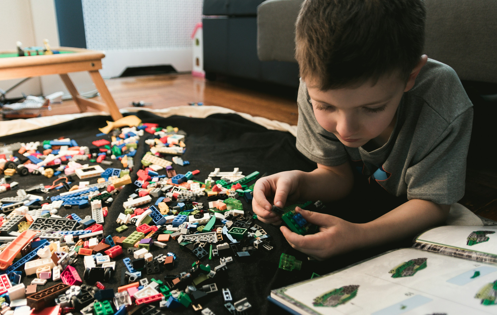

# Absprachen mit Eltern in der Kinderbetreuung: So gelingt professionelle Kommunikation

Ein harmonischer Alltag in der Kita, in der Kindertagespflege oder mit dem Babysitter steht und fällt mit klaren Kinderbetreuung Regeln. Wenn Eltern ihr wertvollstes Gut in fremde Hände geben, ist Vertrauen die wichtigste Währung. Dieses Vertrauen entsteht jedoch nicht durch Zufall, sondern durch Transparenz, Verlässlichkeit und einen stetigen Austausch.

Egal, ob es um Bringzeiten, den Umgang mit Krankheiten oder pädagogische Ansätze geht – eine professionelle Kommunikation in der Betreuung ist der Schlüssel, um Missverständnisse zu vermeiden und dem Kind eine sichere, liebevolle Umgebung zu bieten. In diesem Artikel erfahren Sie, wie Pädagogen und Eltern erfolgreich zusammenarbeiten und welche rechtlichen sowie pädagogischen Rahmenbedingungen dabei entscheidend sind.

## Der Grundstein: Verträge, Regeln und eine sanfte Eingewöhnung

Bevor der eigentliche Betreuungsalltag beginnt, müssen die formellen Rahmenbedingungen geklärt werden. Ein solides Fundament verhindert spätere Konflikte und gibt beiden Seiten Sicherheit.

### Die Betreuungsvereinbarung als Basis

Am Anfang jeder Zusammenarbeit steht der formelle Vertrag, oft schlicht als Betreuung-
Vereinbarung bezeichnet. Hier werden die Rahmenbedingungen der Zusammenarbeit schriftlich fixiert. Zu den wichtigsten Punkten gehören die Rechte und Pflichten im Betreuungsvertrag, wie etwa:

- Genaue Betreuungszeiten und Urlaubsregelungen

- Kündigungsfristen und Zahlungsmodalitäten

- Pflichten der Eltern (z. B. das Bereitstellen von Wechselkleidung oder Windeln)

- Pflichten der Einrichtung (z. B. die Gewährleistung des Betreuungsschlüssels)

### Die Eingewöhnungsphase

Ein reibungsloser Start ist emotional für das Kind und die Eltern eine Herausforderung. Um diesen Übergang so sanft wie möglich zu gestalten, arbeiten heute die meisten professionellen Einrichtungen mit einem strukturierten Eingewöhnungskonzept, häufig nach dem Berliner oder Münchener Modell. Dieses Konzept sieht vor, dass ein Elternteil das Kind in den ersten Tagen begleitet. Die Trennungszeiten werden behutsam und individuell an das Verhalten des Kindes angepasst, gesteigert. Diese Phase erfordert intensive Absprachen mit Eltern, um Unsicherheiten abzubauen und dem Kind zu signalisieren: Hier bist du sicher, Mama und Papa vertrauen diesen Menschen.

## Der Betreuungsalltag: Sicherheit und Hausordnung

Sobald das Kind eingewöhnt ist, beginnt der reguläre Alltag. Damit dieser reibungslos funktioniert, bedarf es klarer Leitplanken.

### Verbindliche Strukturen durch Hausordnungen

Besonders bei Tagesmüttern und -vätern ist eine Hausordnung für private Kinderbetreuung essenziell. Sie regelt praxisnahe Dinge: Müssen Hausschuhe getragen werden? Dürfen eigene Spielzeuge mitgebracht werden? Wie wird das gemeinsame Frühstück organisiert? Solche Dokumente schaffen Klarheit und entlasten die tägliche Kommunikation, da allgemeine Regeln nicht immer wieder neu verhandelt werden müssen.

### Die wichtige Frage: Wer holt das Kind ab?

Ein sicherheitsrelevantes Thema, das im Vorfeld zweifelsfrei geklärt werden muss, lautet: Wer darf mein Kind von der Betreuung abholen?

- Grundregel: Ohne schriftliche Vollmacht der Sorgeberechtigten darf das Personal das Kind an niemanden übergeben – auch nicht an die eigenen Großeltern oder älteren Geschwister.

- Praxistipp: Legen Sie im Idealfall direkt bei Vertragsabschluss eine Liste mit abholberechtigten Personen (inklusive Ausweiskopie oder genauer Daten) an. Sollte es spontane Änderungen geben, müssen diese der Einrichtung morgens zwingend mitgeteilt werden.

## Rechtliche Aspekte: Aufsichtspflicht, Haftung und Versicherung

Wo Kinder spielen, toben und die Welt entdecken, passieren auch Unfälle oder es geht etwas zu Bruch. Das deutsche Recht hat hierfür klare Vorgaben, die sowohl Eltern als auch Betreuungspersonen kennen sollten.

### Die Aufsichtspflicht im Detail

Die Aufsichtspflicht im Kindergarten oder in der Tagespflege beginnt genau in dem Moment, in dem die Eltern das Kind an die Fachkraft übergeben, und endet mit der persönlichen Rückgabe. Das bedeutet jedoch nicht, dass Erzieher jeden Schritt des Kindes lückenlos überwachen müssen. Die Aufsichtspflicht richtet sich nach Alter, Charakter des Kindes und der jeweiligen Situation. Kinder sollen schließlich auch Eigenständigkeit erlernen.

Besondere Vorsicht ist geboten, wenn die gewohnte Umgebung verlassen wird. Die Aufsichtspflicht bei Ausflügen und Spaziergängen ist ungleich höher. Hier gelten strengere Betreuungsschlüssel, oft müssen Warnwesten getragen werden, und das Personal muss das Gelände (z. B. einen öffentlichen Spielplatz) vorab auf Gefahren wie Glasscherben oder giftige Pflanzen prüfen.

### Haftung und Versicherungsschutz

Was passiert, wenn ein Kind beim Spielen die Brille eines anderen Kindes zerstört oder das Fenster des Nachbarn einwirft? Hier greift die Frage der Haftung bei Sachschäden durch Minderjährige. In Deutschland gilt: Kinder unter sieben Jahren sind laut BGB deliktunfähig.
Im motorisierten Straßenverkehr liegt diese Grenze sogar bei zehn Jahren. Sie können für Schäden nicht haftbar gemacht werden. Wenn die Aufsichtsperson ihre Pflicht nicht verletzt hat, bleiben Geschädigte oft auf den Kosten sitzen, es sei denn, die Familienhaftpflicht übernimmt den Schaden freiwillig aus Kulanz.

Für Tagesmütter und -väter ist daher der Versicherungsschutz in der Kindertagespflege ein unabdingbares Thema. Eine spezielle Berufshaftpflichtversicherung ist zwar nicht bundesweit gesetzlich vorgeschrieben, wird aber von vielen Jugendämtern für die Pflegeerlaubnis verlangt oder als Sammelhaftpflicht angeboten. Sie schützt die Betreuungsperson vor dem finanziellen Ruin, falls es trotz angemessener Aufsicht zu einem Personenschaden kommt.

### Sonderfall: Babysitter

Auch im privaten Bereich gelten Regeln. Die gesetzlichen Anforderungen an Babysitter beinhalten unter anderem das Jugendarbeitsschutzgesetz (Kinder ab 13 Jahren dürfen mit Zustimmung der Eltern leichte Tätigkeiten wie Babysitten übernehmen, höchstens zwei Stunden täglich und nicht zwischen 18 und 8 Uhr; für Jugendliche ab 15 gelten erweiterte Arbeitszeiten). Auch hier geht die Aufsichtspflicht für die vereinbarte Zeit vollumfänglich auf den Babysitter über.

## Gesundheit und Notfälle: Wenn es mal nicht nach Plan läuft

Eines der häufigsten Streitthemen zwischen Eltern und Pädagogen ist der Umgang mit Krankheiten. Hier prallen oft die beruflichen Verpflichtungen der Eltern auf den Gesundheitsschutz der Kindergruppe.

### Krankheiten und Wiederzulassung

Ein krankes Kind gehört in sein Bett und nicht in die Betreuung. Das ist nicht nur eine moralische Vorgabe, sondern oft auch eine rechtliche. Besonders bei ansteckenden Krankheiten wie Magen-Darm-Infekten, Bindehautentzündung oder meldepflichtigen Krankheiten greift das Infektionsschutzgesetz (Wiederzulassung nach Krankheit).

- Regel: Oft gilt, dass ein Kind mindestens 24 bis 48 Stunden symptom- und fieberfrei sein muss, bevor es die Einrichtung wieder besuchen darf.

- In manchen Fällen (z. B. nach Scharlach oder Kopfläusen) verlangen Kitas ein ärztliches Attest zur Bestätigung der Gesundung.

### Medikamentengabe

Darf die Erzieherin meinem Kind mittags den Hustensaft geben? Die Regelungen zur Medikamentengabe in der Kita sind sehr strikt. Grundsätzlich ist medizinisches Handeln nicht Aufgabe von Pädagogen. Eine Ausnahme bilden chronische Erkrankungen (wie Asthma, Diabetes oder schwere Allergien, die ein Notfallset erfordern). Hierfür muss jedoch zwingend eine schriftliche ärztliche Verordnung sowie eine Haftungsfreistellung durch die Eltern vorliegen.
Herkömmliche Antibiotika oder fiebersenkende Mittel dürfen in der Regel nicht verabreicht werden.

### Notfallmanagement

Gerade in der Kindertagespflege, wo oft nur eine einzige Tagesmutter arbeitet, ist ein Notfallplan bei plötzlichem Ausfall der Betreuungsperson Pflicht. Was passiert, wenn die Tagesmutter morgens mit Grippe aufwacht? Gibt es eine Vertretungsstützpunkt? Können sich Eltern untereinander vernetzen? Solche Szenarien müssen vorab im Rahmen der Betreuungsvereinbarung transparent kommuniziert werden, um Eltern nicht kurzfristig in unlösbare Organisationsnöte zu stürzen.

## Pädagogischer Alltag: Entwicklung, Konflikte und Mitbestimmung

Eine gute Betreuung zeichnet sich nicht nur durch das bloße "Aufpassen" aus, sondern durch qualitativ hochwertige pädagogische Arbeit. Hier ist eine kontinuierliche Kommunikation zwischen Eltern und Pädagogen unerlässlich. Entwicklungsgespräche, Tür-und-Angel-
Gespräche beim Bringen sowie Elternabende bilden das Rückgrat dieser Partnerschaft.

### Konflikte als Lernchance

Kinder streiten. Das ist normal und ein wichtiger Teil ihrer sozialen Entwicklung. Die Aufgabe der Fachkräfte ist es, den Umgang mit Konflikten unter Kindern zu moderieren, anstatt sofort strafend einzugreifen. Kinder sollen lernen, eigene Grenzen aufzuzeigen ("Stopp, das will ich nicht!") und Empathie für den anderen zu entwickeln. Wenn Eltern in die Kita kommen und hören, dass ihr Kind in einen Streit verwickelt war, ist eine sachliche, nicht wertende Kommunikation seitens der Erzieher wichtig, um gemeinsam an einer Lösung zu arbeiten.

### Demokratie im Kleinen

Moderne Pädagogik sieht das Kind als kompetentes Wesen. Daher wird Partizipation und Mitbestimmung im Kita-Alltag großgeschrieben. Kinder dürfen altersgerecht mitentscheiden:
Was möchten wir heute frühstücken? Welches Buch lesen wir im Morgenkreis? Welche Regeln wollen wir in der Bauecke aufstellen? Diese gelebte Demokratie stärkt das Selbstbewusstsein der Kinder enorm. Auch hier müssen Eltern durch regelmäßigen Austausch mitgenommen werden, damit sie die pädagogischen Ziele hinter diesen Methoden verstehen und idealerweise zu Hause weiterführen können.

## Ein Blick auf die Moderne: Datenschutz in der Betreuung

Wir leben im digitalen Zeitalter. Es ist verlockend für Erzieher, den Eltern einen süßen Schnappschuss vom Laternenbasteln per Messenger zu schicken. Doch Vorsicht: Die Datenschutzrichtlinien für Fotos in Betreuungseinrichtungen sind streng und durch die DSGVO (Datenschutz-Grundverordnung) klar geregelt.

- Kein Foto ohne Erlaubnis: Es bedarf einer ausdrücklichen, schriftlichen Einwilligung der Eltern, bevor auch nur ein einziges Bild gemacht werden darf.

- Verwendungszweck: Es muss klar definiert sein, wofür die Fotos genutzt werden (z. B.
nur für das interne Portfolio des Kindes, für Aushänge in der Kita oder für die öffentliche Webseite).

- Sichere Kommunikation: Der Versand von Kinderfotos über private WhatsApp-Gruppen ist aus Datenschutzgründen ein absolutes Tabu. Professionelle Einrichtungen nutzen hierfür spezielle, DSGVO-konforme Kita-Apps, über die eine sichere Kommunikation zwischen Eltern und Pädagogen gewährleistet wird.
