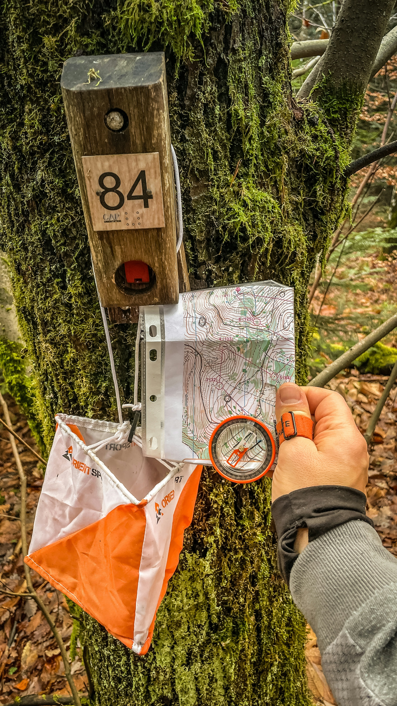

# Finding a Babysitter in Mannheim and Heidelberg – The Great Guide

### Introduction

The search for a babysitter is more than just an organizational task for many parents – it is a true decision of trust. Especially in cities like Mannheim and Heidelberg, where career and family life are closely intertwined, flexible and simultaneously high-quality childcare plays a central role.

While in the past availability and price were often the main focus, today parents pay more attention to the quality of care. They don't just want a supervisor, but someone who understands, supports, and actively accompanies their child. This is exactly where the Mannheim and Heidelberg region offers a decisive advantage.

## The Special Location Advantage

Mannheim and Heidelberg are among the most important educational locations in Germany. With institutions like the University of Heidelberg, the Heidelberg University of Education, the University of Mannheim, as well as universities for social work and social sciences, there are particularly many well-trained caregivers in the region.

This means: Many babysitters in this region are not only experienced – they are professionally trained or are in the middle of their pedagogical education.

For parents, this results in a clear advantage: They can specifically choose caregivers who have sound knowledge in developmental psychology, pedagogy, and child-appropriate support.

## Why Pedagogical Care Makes the Difference

A babysitter with a pedagogical background goes far beyond classic care. Children are not only supervised but actively supported.

This is shown in everyday life through:

- Age-appropriate play and learning offers

- Structured daily routines

- Empathetic handling of emotions

- Professional behavior in conflict situations This form of care brings not only short-term relief but long-term added value for the development of your child.

## The Best Ways to Search for a Babysitter Parents in Mannheim and Heidelberg have various options for finding a suitable babysitter.

Online platforms, especially specialized offers like trustolino.de, offer the greatest advantages here. Here you will find verified profiles with a pedagogical background, reviews, and transparent communication.

Personal recommendations or agencies can also be used as a supplement. Nevertheless, practice shows: Digital platforms offer the best combination of quality, speed, and transparency.

## What You Should Look Out for When Choosing

The choice of the right babysitter should be structured. In addition to sympathy, measurable criteria play a decisive role.

Pay particular attention to:

- Pedagogical education or studies

- Experience with comparable age groups

- Communication skills and reliability

- First aid knowledge Especially in Mannheim and Heidelberg, it is worth looking specifically for students of teaching or social pedagogy.

## Correctly Assessing Costs and Quality

Prices for babysitters vary greatly depending on qualification. While classic care is available from around €10–15 per hour, pedagogically qualified staff are often between €15 and €25 or more.

The right perspective is important: Higher costs in this case usually also mean significantly higher quality.

Parents are thus not only investing in care – but in the development of their child.

## Trust and Long-Term Cooperation

A successful babysitter relationship does not develop overnight. Trust develops through clear communication, transparent expectations, and regular feedback.

Long-term care brings clear advantages:

- Children build a stable relationship

- Routines develop

- Parents gain planning security Especially with pedagogically qualified caregivers, a relationship often develops that goes far beyond classic babysitting.

## Conclusion

The search for a babysitter in Mannheim and Heidelberg offers ideal conditions, provided parents consciously focus on quality.

Due to the high density of pedagogical universities, an exceptionally qualified pool of caregivers is available.

Those who specifically use platforms that focus on this quality not only create relief in everyday life but make a sustainable decision for the development of their own child.
