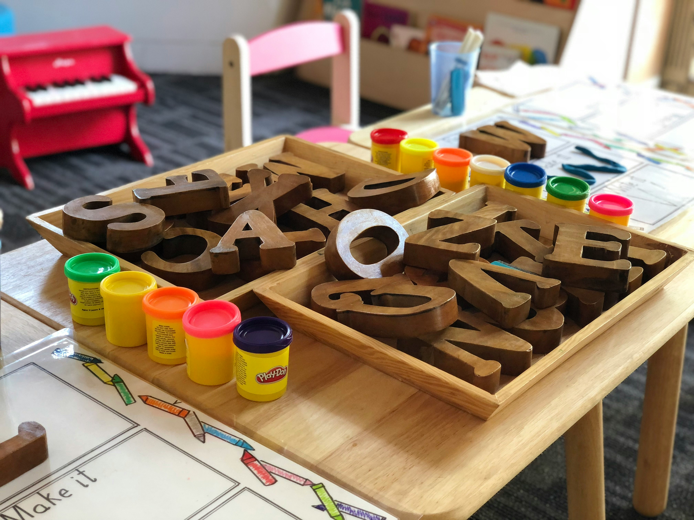

# Finding families as an educator: How to win suitable childcare children (serious & efficient)

As an educator, you do valuable work every day. You are a confidant, development companion, and crisis manager all in one. However, professionals often look for ways to build up an additional financial pillar alongside the often stressful everyday daycare life. Babysitting for educators is an excellent choice here. A childcare part-time job not only offers you flexible working hours, but also allows you to bring your expertise into a more relaxed, 1-on-1 setting.
But how do you approach this project professionally? In this article, you will learn step by step how to find serious families, how to calculate your fee correctly, and which legal framework conditions you absolutely must observe.

## Why your pedagogical expertise is worth its weight in gold

Many parents are desperately looking for reliable people to look after their offspring. When they have the choice between an untrained teenager and a trained professional, the decision is often easy. The differences in qualification in childcare are simply enormous, and parents who value quality are happy to invest more for it.
You offer much more than just mere presence until the parents return from dinner. Through your pedagogical expertise in the private environment, you can specifically respond to the developmental stages of the children. Be it the confident handling of childish tantrums, support with developmental delays, or simply individual promotion in the home environment through age-appropriate games and creative offers.

The advantages of professional caregivers are clear to parents:

- Well-founded knowledge: You recognize childish needs immediately and act pedagogically sensible

- First aid knowledge: As a professional, you are usually emergency trained for children

- Reliability & commitment: You bring a professional work attitude

- Targeted promotion: You don't just do crafts, you playfully promote fine motor skills, language, and cognition

## Finding families for educators: How to proceed strategically

Once you have decided to offer your services, you face the challenge of customer acquisition. Finding childcare children has become easier thanks to today's shortage of skilled workers, but after all, you want to attract families who appreciate your qualifications and remunerate them accordingly.

### Using digital paths

The most efficient route today is via the Internet. Use a secure childcare platform that verifies profiles and offers a serious framework for placement. Such portals often have search filters with which parents can specifically search for trained educators, child nurses, or social pedagogues. Create an appealing profile that immediately catches the eye.

#### Tips for your online profile:

- Clearly state your training (e.g. state-recognized educator).

- Describe your educational style and your focal points (e.g. Montessori, forest pedagogy, early musical education).

- Upload high-quality references and pedagogical proof of qualifications. Black out sensitive data from previous employers, but show that you have real certificates.

### Local network & word of mouth

In addition to digital platforms, classic networking is not to be underestimated. Finding families for educators often works via recommendations. An important note in advance: Avoid caring privately for children from your own daycare group unless your employer explicitly allows this. This can lead to role conflicts and resentment among other parents.

Instead, put up professionally designed notices in places where affluent families who value education hang out:

- In music schools or with providers of PEKiP courses.

- In high-quality organic supermarkets or family-friendly cafes.

- In pediatricians' practices (after prior consultation with the practice team).

## Finances: How much is your time worth?

One of the most common mistakes pedagogical professionals make is modesty. A part-time job for pedagogical professionals can and should be paid significantly better than classic pocket-money babysitting. You are a luminary in your field.

Your hourly wage for qualified childcare depends on various factors:

- Region: In Munich, Frankfurt, or Hamburg, you can charge higher prices than in rural regions.

- Tasks: Is it just about bedtime, or do you offer active promotion in the afternoon including homework supervision?

- Number of children: A surcharge should be calculated for siblings.

Generally, fee expectations with a pedagogical background in the range of 18 to 25 euros per hour (and sometimes beyond) are absolutely realistic and justified.

Communicate these prices confidently from the start. Prepare for questions and argue with your training, your experience, and the exclusive support opportunities that the child receives through you.

## Legal requirements for private childcare

As soon as money flows, you are in a professional context. No matter how familiar the relationship with the parents is, you must strictly comply with the legal requirements for private childcare in order to not experience any nasty surprises.

### Agreement with the main employer

As an employee in a daycare center or other facility, you must first obtain a secondary employment permit from your employer. The labor law regulations for secondary employment usually state that the main job must not be impaired by the part-time job. The statutory maximum working hours from the main and part-time jobs (usually 48 hours per week) must also not be permanently exceeded. Talk openly with your management - usually, such a part-time job is approved without any problems.

### Registration and tax issues

Anyone who regularly cares for money is not working undeclared. The legally cleanest and for both sides most uncomplicated way is registration with the Minijob Central (as a so-called household check). The family registers you there as a domestic helper for childcare. This has the advantage for the family that they can deduct a part of the costs from tax, and for you that you are insured against accidents and collect pension points upon request.

If you do not work on a mini-job basis, but on an invoice, you act independently. Here it is important to observe the tax treatment of freelancers. You must declare your income in your annual tax return in Annex S (Income from self-employment). Use the basic tax-free allowance here, but inform yourself in advance with a tax advisor or the tax office from when a trade or freelance activity must be officially registered.

## Protection in an emergency: Insurance cover

Accidents happen with children - nobody knows that better than you. Comprehensive insurance cover for private caregiving activities is therefore indispensable.
If you are registered via the household check procedure (mini-job), you are covered against accidents on the way to work and during work via the statutory accident insurance. But what happens if you accidentally ruin the parents' expensive sofa or, in the worst case, the child is harmed due to carelessness?

A normal private liability insurance covers acts of courtesy, but often does not apply to paid, regular activities! You urgently need an adjustment of your policy or a special liability insurance for pedagogical staff. This professional liability insurance usually costs only a small double-digit amount per year, but saves you from financial ruin in an emergency. Therefore, check your contract conditions in detail before you start your first day of work.

## The first meeting: Professionalism from the start

Once you have found an interested family, the first meeting takes place. Treat this meeting like a relaxed but professional job interview. It serves not only for the parents to sniff you out, but also for you to check if the chemistry is right.
Pay attention to the following points during the initial conversation:

1. Compare educational goals: Clarify which values are important to the parents. If the parents cultivate an extremely authoritarian educational style, but you work absolutely needs-oriented, conflicts are pre-programmed.
2. Set clear boundaries: Discuss exactly what is part of your tasks. You are an educator and not a cleaning lady. Loading the dishwasher or mopping the floors is not part of your field of activity unless you expressly agree on this and adjust the fee accordingly.
3. Define emergency plans: Get information on pre-existing conditions, allergies, and the contact details of the pediatrician and the parents.
4. Agree on a trial work: Offer a paid trial work where the parents are initially in the next room or home office while you occupy yourself with the child. This way you quickly notice whether the child accepts you as a caregiver.

## Conclusion: Your pedagogical value in a private setting

Babysitting for educators is a wonderful opportunity to broaden your professional horizon and significantly improve your own income. You have the enormous advantage that you bring expertise, patience, and experience - qualities that are invaluable to parents.

If you approach the topic strategically, cleanly clarify the formalities surrounding contracts, taxes, and insurance, and confidently communicate your value, this part-time job will not only be a financial enrichment, but also professionally a lot of fun. Present yourself professionally, use secure platforms for placement, and look forward to the enriching work with families who truly appreciate your pedagogical work.
