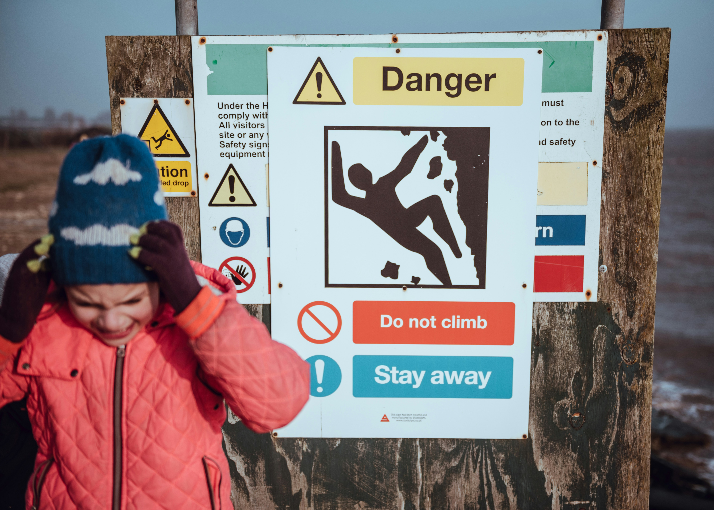

# Childcare Safety Checklist: 15 Crucial Points for Parents (2026 Guide)

## Why Safety in Childcare is a Top Priority

Children are particularly in need of protection. At the same time, care often takes place in a private environment – without direct control by parents.

The biggest risks arise from:

- lack of pedagogical experience

- unclear emergency reactions

- lack of reliability

- lack of structure in childcare Safe childcare is no accident – but the result of clear vetting.

## Childcare Safety Checklist (Quick Overview)

- Qualifications of the caregiver

- Personal meeting

- References & experience

- Clear rules in the household

- Emergency plan & availability

## The Ultimate Childcare Checklist for Parents

1.  Check pedagogical qualifications 2.  Verify experience and references 3.  Conduct a personal meeting 4.  Define clear rules 5.  Clarify safety rules and first aid knowledge for children 6.  Create an emergency plan 7.  Check reliability 8.  Clarify behavior and responsibility 9.  Conduct trial childcare 10. Record the agreement 11. Base trust on facts (e.g. request to see an extended certificate of good conduct) 12. Observe the child's well-being 13. Evaluate communication 14. Check long-term availability 15. Evaluate the overall impression

## Avoid Typical Mistakes

- Selection based only on sympathy

- no qualifications checked

- no emergency plan

- no clear structure These mistakes can be avoided with a checklist.

## Why Qualified Care is Crucial

Pedagogically trained caregivers understand child development, react safely in an emergency, and create clear structures. This significantly increases safety for your child.

## Trustolino: Safe Childcare Redefined

Trustolino relies exclusively on vetted pedagogical professionals. Parents benefit from verified quality, structured care, and maximum safety.

## FAQ – Frequently Asked Questions

### What should you look out for?

Qualifications, experience, first-aid knowledge, an extended certificate of good conduct, clear rules, and an emergency plan.

### How do I find a safe babysitter?

Through structured vetting, interviews, and trial childcare.

## Conclusion

The right childcare is based on qualifications, structure, and trust. With this checklist, you can make safe decisions.
