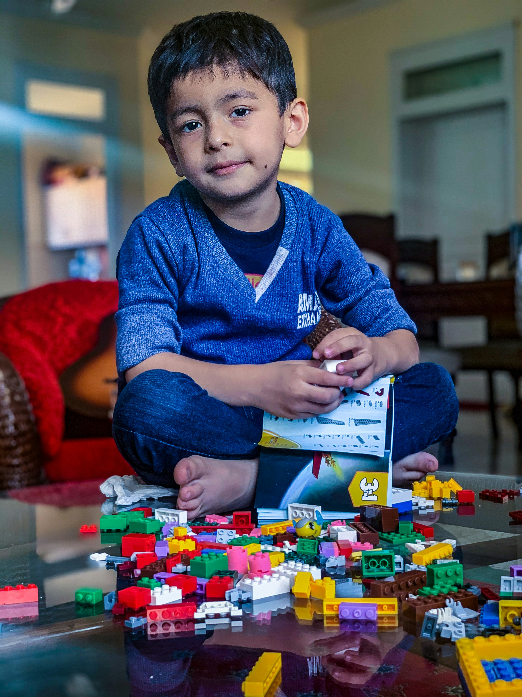

# Part-time job during Pedagogy Studies: How to find conditions that really fit

Are you looking for a meaningful part-time job during your pedagogy studies in Germany, ideally in Mannheim, Heidelberg, or the Rhine-Neckar region, and want to do more than just earn money? Then it is worth planning the part-time job as a first building block for your future application: A job with regular contact with children (and parents) can bring you verifiable practical experience, references, and skills even during your studies, which daycare managers and social providers really want to see later.

### Which part-time job makes sense for pedagogy students?

Above all, jobs in which you take on responsibility and work continuously with children, e.g. long-term family care (regularly instead of "now and then"), care in all-day school/after-school care, learning support/tutoring with a pedagogical focus, or assistance in a daycare center/school.

### How can you gain practical experience during your studies?

By looking for tasks that are pedagogically "real": organizing arrivals, perceiving needs, accompanying conflicts, observing development, taking over parent communication, and being reliably present for months. Exactly this continuity makes family care, even if it is formally not always considered classic daycare experience, a meaningful proof of practice for many employers.

In this guide, you will learn how to choose a part-time job that fits your schedule and at the same time strengthens your practical profile, including concrete examples from everyday student life, tips on compatibility, and advice on how you can convincingly use reviews, references, and long-term care relationships later in applications.

The course catalog is packed with modules on developmental psychology, didactic models, and early childhood education. But when you sit in the lecture hall debating Piaget or Vygotsky, you might ask yourself: What does all this actually look like in reality? Exactly this is where the ideal part-time job during pedagogy studies comes into play.

Anyone who opts for childcare as a part-time job kills two birds with one stone: You earn the necessary money for rent, books, and free time and at the same time gain invaluable practical experience in your pedagogy studies. But how do you find families or institutions whose conditions optimally fit your schedule? And what do you have to look out for legally, financially, and in terms of insurance?

In this guide, you will learn everything you need to know to successfully combine theory and practice and build a valuable professional network on the side.

## Why a part-time job in childcare is the perfect career start

Working with children during your studies is much more than just a way to supplement your student loan (BAföG). Many graduates realize after their exams that they lack direct reference to the target group. However, those who start early benefit massively.

- Theory meets reality: When you know what a tantrum in the terrible twos feels like "in real life", you understand developmental psychology theories in seminars much better. Real pedagogy studies practical experience allows you to look at situations more critically and deeply.

- Competitive advantage on the job market: When you send out your resume later, you already shine with solid pedagogical professional experience. Especially being able to show experience in a later daycare application sets you clearly apart from competitors who only possess theoretical knowledge.

- Building a network: Future childcare professionals often get to know parents through part-time jobs who work in relevant professional fields, or establish direct contacts with providers of pedagogical institutions.

A pedagogy student job also offers you the flexibility you need. You are not bound to rigid shift schedules in retail, but can often arrange your working hours individually with the parents.

## What options do you have? From babysitting to the institution

A part-time job with children has many faces. Depending on the semester, prior knowledge, and time flexibility, you can choose from different models.

1. ### The classic route: Babysitting and nanny jobs The most flexible option is direct work in families. You pick the children up from daycare, play with them, prepare dinner, and put them to bed. For students, this is ideal, as the times can be well planned around lectures.

2. ### Homework help and tutoring Especially for teaching or pedagogy students, homework supervision is an excellent option as a lucrative additional income. Here you are not just a supervisor, but a learning companion. You learn to apply pedagogical concepts directly, to build up frustration tolerance (both in yourself and in the child), and to formulate didactically sound explanations.

3. ### Childminder (Tagesmutter / Tagesvater) Anyone who wants to take on more responsibility and has the spatial prerequisites can also enter professional daycare. The earning potential as a childminder on the side can be very attractive, especially if you care for several children at the same time. Note, however, the significantly higher bureaucratic and spatial effort involved, which takes place in cooperation with the youth welfare office.

## Regional opportunities: Student cities as hotspots

The demand for well-trained, reliable caregivers is huge, especially in large university cities. Many parents in academic households work full-time and urgently need support.

For example, if you are looking for a student job in Heidelberg, you will encounter an urban environment with many families working at the university hospital or in research who need flexible off-peak care. The situation is similar if you are targeting a student job in Mannheim. Due to the density of commercial enterprises in the region, the need for afternoon care or nanny services is enormously high. But the same applies to any other city: Pedagogy students are in particularly high demand among parents.

## Prerequisites and qualifications: What do you really need?

When parents are looking for someone to entrust with their most important thing, they pay attention to certain criteria. But which requirements are really essential for babysitting jobs?

### The paper vs. The practice

Parents often ask for evidence. A common topic is the babysitter diploma compared to pedagogical experience. While a babysitter course from the Red Cross is a great entry point for teenagers, your status as a pedagogy student usually easily trumps this diploma. You are dealing with human development as your main occupation, which creates an enormous amount of trust. In the initial conversation, be sure to mention specific study contents that are relevant to the care.

### Safety first

However, there are two documents that you should definitely have in your pocket, regardless of your studies:

1. First aid course for children certificate: A normal first aid course for a driver's license is not enough here. Babies and toddlers must be reanimated and treated differently in an emergency than adults. This certificate immensely reassures parents and also gives you the necessary security.

2. Extended certificate of good conduct as proof of trust: Anyone who works professionally with children cannot avoid this. It proves that there are no previous convictions (especially in the area of youth protection). For voluntary work or via official providers, it is often free of charge; otherwise, it costs a small fee, which definitely pays off.

## Finances and taxes: Negotiate confidently and work legally

Many students fall into the trap of offering their services below value or moving in the gray area of undeclared work. As an aspiring professional, you should position yourself professionally here.

### Setting the wage right

How much should you ask for? Negotiating the appropriate hourly wage for babysitting is difficult for many. Don't sell yourself short! You are not a 14-year-old teenager earning extra pocket money, but are studying pedagogy. Your base wage should always be above the statutory minimum wage (2026: 13.90 euros per hour). Depending on the region (such as in Munich, Frankfurt, or Heidelberg), 15 to 20 euros per hour are absolutely realistic for experienced students, and even more for several children or special homework help.

### Formalities: From mini-job to self-employment

It is important to handle the whole thing legally clean. There are three common paths here:

1. Registration with the Minijob Central for caregivers: This is the most attractive way for parents. They can register you via the so-called household check procedure. You earn gross as net, are insured against accidents, and the parents can deduct the costs from taxes. Both sides benefit from this.

2. Trainer allowance (Übungsleiterpauschale): If you do not work for a private family, but as a caregiver for a non-profit association (e.g. sports club, church provider, daycare temp), you can earn up to 3,000 euros a year tax-free and exempt from social insurance.

3. Self-employment: If you work on your own account for many different families, your activity is generally considered a freelance (educational or teaching) activity that you declare to the tax office; a trade is usually not necessary. If, on the other hand, you want to regularly care for children in your own premises as a childminder, you need a care permit from the youth welfare office (§ 43 SGB VIII). In case of doubt, clarify the tax treatment of income from caregiving activities in advance with your responsible tax office to avoid nasty surprises on your income tax return. As long as you stay below the basic tax-free allowance, no taxes are incurred, but an obligation to state it in the tax return often still exists.

## Legal framework conditions: Security for you and the children

With the care of children, you take on an enormous responsibility. It is essential that you know the legal framework.

### The duty of supervision

The legal duty of supervision over foreign children passes to you the moment the parents leave the house and hand the children over to you. You must ensure that the children do not harm themselves or others. The duration and intensity of the duty of supervision depend on the age and character of the child. You cannot turn your back on a three-year-old playing on the playground for a second, while a ten-year-old can certainly do homework alone in their room. Discuss the rules (Is the child allowed out alone? Can they go to the fridge?) meticulously with the parents beforehand.

### It doesn't work without insurance

A child breaks free on the street and causes a bicycle accident. Or the child knocks over an expensive vase in the neighbor's apartment. Who pays? Liability insurance for babysitters is existential. Clarify with your private liability insurance (or that of your parents, if you are still co-insured there) whether commercial or paid supervision of foreign children is covered.

Care as a favor (unpaid) is often insured, but regular, paid sideline work is not. A quick phone call to the insurance company provides clarity কাশী here. By the way, if you work as a registered mini-jobber in a private household, the statutory accident insurance applies in the event of an accident at work (if something happens to you).

## The job search: How to find the perfect family or institution

You are highly motivated and have all the documents together. But: How do I find suitable families in my area?

- Online platforms: Use reputable portals for babysitter placement such as Trustolino.de, Betreut.de, or Babysitter.de. Create a detailed profile here. Explicitly mention your studies, your previous experience, and attach (if available) your certificates and the first aid certificate as proof.

- Local notices: The analog way still works excellently in this area. Print an appealing flyer and hang it (with permission) in local daycare centers, primary schools, pediatricians' practices, bakeries, or in music schools.

- University mailing lists and bulletin boards: University institutes or clinics in particular often have their own intranets or bulletin boards. If you search here as a student, you immediately have an advance of trust from university employees.

- Direct application to institutions: If you are looking more for institutional experience, don't shy away from unsolicited applications to local daycare centers, after-school care centers, or all-day schools. Due to the chronic shortage of skilled workers, many institutions are desperately looking for student assistants for the afternoon hours.

During job interviews with parents, pay attention that the "chemistry" is right. Educational styles shouldn't diverge diametrically. If the parents pursue an extremely authoritarian approach, but you have internalized the needs-oriented approach in your studies, conflicts are pre-programmed. Dare to turn down jobs if your gut feeling isn't right.

## Everyday pedagogical life: Play, fun, and development

When the formal part is done, the real fun begins: working with the children. Use the time to practically apply what you have learned in your studies.

Instead of just sitting the kids in front of the TV (which no professional babysitter should do), you can integrate pedagogically valuable games for different age groups into your daily care routine:

- Under 3 years (U3): In this phase, it's very much about sensorimotor development. Offer pouring games (e.g. pouring rice from cup to cup), build obstacle courses from pillows to train gross motor skills, or sing songs together with movements.

- Kindergarten age (3-6 years): Imagination blossoms. Role-playing (playing shop, visit to the doctor) promotes empathy and language skills. Free painting, modeling clay, and first simple board games like Orchard are also ideal for playfully practicing an understanding of rules and frustration tolerance.

- Primary school age (6-10 years): Here you can tackle more complex projects. Go into nature and collect leaves for a herbarium, cook together (promotes mathematical understanding by measuring ingredients) or play cooperative board games that require strategic thinking.

When parents see that you actively engage and that the children are happy and mentally challenged after care, they will not only want to keep you long-term, but also warmly recommend you to their circle of friends.

## Keeping the balance: Combining studies and job

The biggest mistake students make is to overextend themselves. Childcare can be physically and mentally exhausting. Caring for a defiant toddler for four hours after a long morning at university requires a lot of energy.

Communicate your availability clearly from the start. Especially in the exam phase, you need more time for yourself. Good employers (in this case, the parents) will understand this if you communicate it early on, ideally weeks in advance. Make an exact weekly schedule and block fixed times for preparation and follow-up for university as well as for recovery.

## Conclusion: A part-time job that is more than just making money

Childcare is undoubtedly one of the most meaningful and rewarding part-time jobs you can choose as a student in the pedagogical field. You exchange the gray theory of the lecture hall for the colorful chaos of real life.

You develop important skills such as patience, communication skills with parents, and spontaneous crisis management. At the same time, you build up your resume, earn fair money, and make contacts that can be very valuable for your future career path.

If you take the legal and financial framework conditions seriously, confidently negotiate your hourly wage, and shine with pedagogical know-how, you lay the perfect foundation for your future career. So: get your certificates up to date, write an appealing profile, and dive into practice. The families are already waiting for you!
